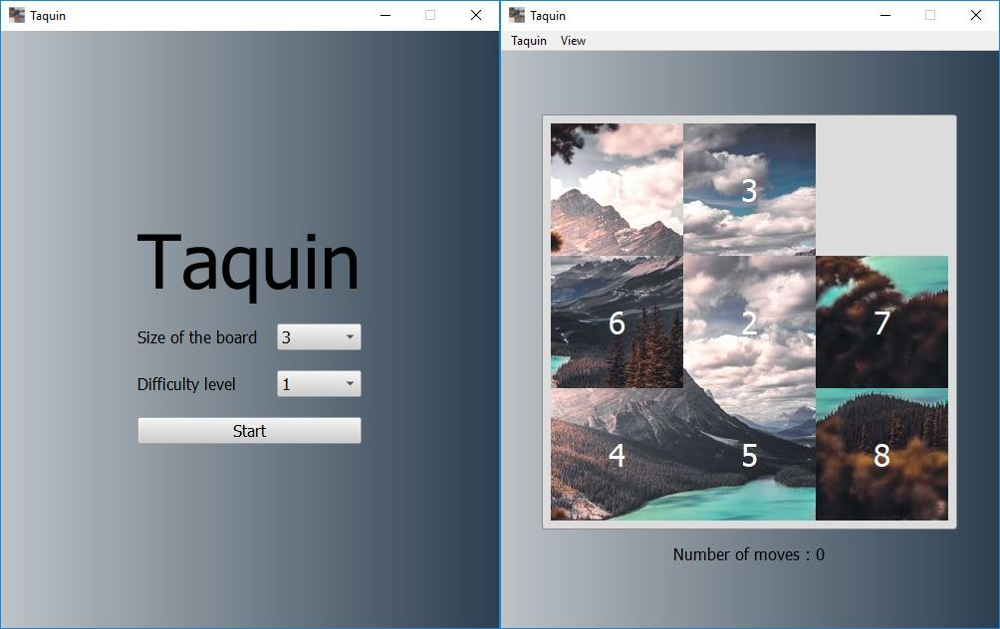

# Taquin 

## Description

Le taquin est un jeu solitaire en forme de damier créé vers 18701 aux États-Unis. Sa théorie mathématique a été publiée par l'American Journal of mathematics pure and applied2 en 1879. En 1891, son invention fut revendiquée par Sam Loyd3, au moment où le jeu connaissait un engouement considérable, tant aux États-Unis qu'en Europe. Il est composé de 15 petits carreaux numérotés de 1 à 15 qui glissent dans un cadre prévu pour 16. Il consiste à remettre dans l'ordre les 15 carreaux à partir d'une configuration initiale quelconque.

Le principe a été étendu à toutes sortes d'autres jeux. La plupart sont à base de blocs rectangulaires plutôt que carrés, mais le but est toujours de disposer les blocs d'une façon déterminée par un nombre minimal de mouvements. Le Rubik's Cube est aujourd'hui considéré comme l'un des « descendants » du taquin. [Wikipedia](https://fr.wikipedia.org/wiki/Taquin)

## Licensing

With confirmation from my laboratory supervisor I would like to post this project on my personal github with the license below (to be confirmed).

**Question: Can a real game under private license be licensed to copy-left in the "digital world"?**

This app is Licensed under the GNU General Public License v3.0. See [LICENSE](LICENSE) for the full license text.

