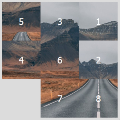

# Taquin 

## Description

## Model Structure

## Additional Informations

### Code (additional information - comments)

### Other

## Licensing

With confirmation from my laboratory supervisor I would like to post this project on my personal github with the license below (to be confirmed).

**Question: Can a real game under private license be licensed to copy-left in the "digital world"?**

This app is Licensed under the GNU General Public License v3.0. See [LICENSE](LICENSE) for the full license text.

